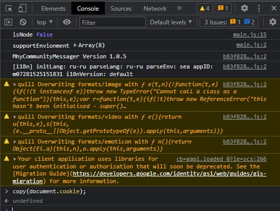

# HoYoLab-API
A small API for working with HoYoLab. Primarily developed for daily rewards in Genshin Impact

## Usage:
### Getting HoYoLab account cookies
To use the API, you will need HoYoLab cookies. To get them, go to www.hoyolab.com, authorize and press F12 -> Console -> Enter this in text field:
```js
copy(document.cookie);
```
Done! Cookies copied in your clipboard.



### Creating a new HoYoLab Account instance
To create a new account instance, you need to have cookies string (formatted like a example below).

```csharp
using HoYoLab_API;

public void SomeMethod()
{
    var account = new HoyolabAccount(
                rawCookies: "ltoken=12AOxlS0gnNGqQ2kOgJR2C2g28S1uU6dgBT0qgKa; ltuid=52606212", language: "en-us", userAgent: "Mozilla/5.0 (Windows NT 10.0; Win64; x64; rv:100.0) Gecko/20100101 Firefox/100.0");
}

```

### Supported account languages: 
| Language | Code |
| --- | --- |
| English | en-us |
| Pусский | ru-ru |
| 日本語 | ja-jp |
| 한국어 | ko-kr |
| Deutsch | de-de |
| Español | es-es |
| Français | fr-fr |
| Indonesia | id-id |
| Português | pt-pt |
| ภาษาไทย | th-th |
| Tiếng Việt | vi-vn |
| 简体中文 | zh-cn |
| 繁體中文 | zh-tw |

### How to check is the authentication in HoYoLab success:
```csharp 
if (account.IsValid)
{
    <...>
}
```

### Examples: 
```csharp 
Console.WriteLine(string.Join(", ", account.GameAccounts));
Console.WriteLine(account.DailyCheckIn.CurrentMonthlyRewards);
Console.WriteLine(account.DailyCheckIn.CurrentRewardInformation);
Console.WriteLine(account.DailyCheckIn.ClaimReward());
```
Preview: 

